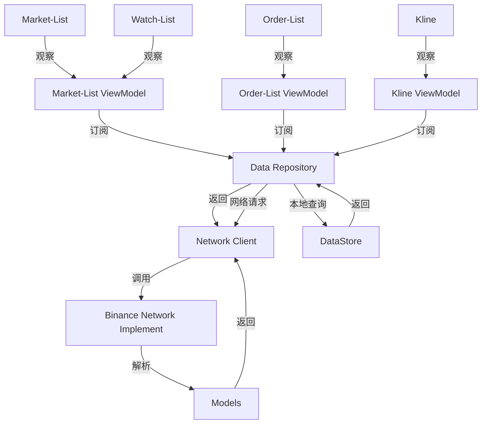

# Coding Task: Android Trading App

## 构建/运行步骤

### Android Studio

1. **导入项目**
	- 打开 Android Studio → "Open" → 选择项目目录
2. **Gradle 同步**
	- 自动触发或手动点击 "Sync Project with Gradle Files"
3. ### **构建与运行**
	- 选择目标设备 -> `run / debug Configurations`选择默认配置`app`-> 点击`▶️`

### 命令行

​	在项目根目录执行命令，以构建对应的APK：

```bash
./gradlew assembleDebug
```
​	APK路径：app/build/outputs/apk/debug/app-debug.apk


​	或者执行，直接安装到设备
```bash
 ./gradlew installDebug
```


## 图表库选择及依据

针对提及的三种图表库，经过粗略的简单调研，大概可以得到以下

|              | TradingView                                                  | MPAndroidChart                   | AnyChart                                                 |
| ------------ | :----------------------------------------------------------- | -------------------------------- | -------------------------------------------------------- |
| **目标定位** | **专业金融图表**                                             | **移动端基础图表**               | **企业级报表**                                           |
| **平台支持** | Web，**移动端通过PWA有限支持**                               | **Android原生**                  | **跨平台**                                               |
| **使用成本** | 高（免费版功能受限且有广告，收费版功能完整但比较贵，实时数据需要另外付费） | 低（完全开源免费）               | 中（免费版可个人使用基础功能，企业版需要付费）           |
| **运行性能** | 较好（渲染较快，但内存占用较高）                             | 很好（渲染很快，内存占用也较低） | 一般（大数据量渲染较慢，内存占用也不低）                 |
| **开发难度** | 较高（Web接入，或者大量图形开发，数据API开发也较为复杂）     | 一般（Android原生接入即可）      | 较低（功能完善，但大数据量时可能需要额外的性能优化开发） |

* ### 功能 & 费用

  从功能上来说，相比于**MPAndroidChart**，**TradingView**聚焦于金融分析使用，**AnyChart**则提供了更为完善的各种图标支持。但对于这次的开发目标是一个最基础的图表类型，如不考虑进一步后续演进需要，三者的**免费版本**都能覆盖需求场景。

* ### 性能

  考虑到**TradingView**是Web实现，WebGL加速后的渲染性能很不错，但内存占用的问题不可避免；**MPAndroidChart**由于完全原生实现，性能表现无可指摘；而**AnyChart**由于跨平台框架的原因，各方面表现不太理想。从性能上来说，**MPAndroidChart**最优，但考虑到现代手机的性能，**TradingView**的内存问题也完全能够接受，考虑到哪怕是这次的目标场景，数据量可能增长较快，**AnyChart**存在一定的理论风险。

* ### 开发

  **TradingView**对于小团队一般推荐使用WebView集成，虽然理论上插入即用，但如果要多加定制，最终都不可避免引入额外的Web相关技术，增加了技术风险的成本；而不使用WebView的情况下，原生渲染需要更多的开发工作量；官方SDK接入则有更多的授权限制，功能情况不明。**MPAndroidChart**考虑到完全原生实现，个人技术熟练，社区文档充足，并且曾有过使用经验了解大致情况，整体风险非常可控。**AnyChart**理论上使用最为简单，但需要考虑到跨平台的技术可能引入的潜在不确定性，以及渲染性能需要额外优化开发的风险。

综上所述，功能上三者都能满足需要，性能上**AnyChart**虽然存在理论分享，但三者粗看应该都能满需要。考虑到这次时间较为紧迫，出于降低技术原因带来的风险，选择了最为技术可控的**MPAndroidChart**作为图标库方案。

## 架构决策与权衡



整体架构按主流的分成的思路，分为五层：

* **UI：**各类Compose组件封装UI交互逻辑，并通过状态监听关注ViewModel层的数据变化。
* **ViewModel：**UI上所需内容数据、加载状态的持有，并完成业务处理及更新。
* **Repository：**提供所有数据层面各种读写操作的统一入口，根据实际需要转发到各个子模块（网络请求、本地存储）。
* **Network：**提供网络请求的统一抽象，将请求分发给子模块。不同子模块分开实现针对不同交易所数据源、不同API接口类型，并将返回结果统一抽象。
* **Model:**提供全局统一数据结构类对象。

### 一些技术选型问题

#### 关于UI技术选择

最初的技术倾向于传统的**XML方案**，但考虑到对**ViewBinding**的要求，和**Compose**相比，两者熟练度都有限，但**Compose**方案显然更为官方主推的技术路径（**ViewBinding**在使用上也比较受限，尤其对于渲染不受自己控制的场景不太灵活），最后选择了**Compose**作为整体的UI方案。

#### 关于数据存储方案选择

**DataStore**更为轻量，使用成本更低，在需求比较简单的情况下，不需要更复杂的存储能力足以覆盖。对于**DataStore**的`Protobuf`支持也同理，相比于`Protobuf`更高的接入成本，对于数据量较低的简单场景，使用`json`序列化足以覆盖。

#### 关于网络层抽象

考虑到作为网络数据源的Binance API终究是一个特殊情况，如有需要随时有可能需要换成其他交易所或者本地数据源，所以需要额外一层抽象使其与实际业务隔离。同时由于返回数据结构强相关于API接口，为了减少对本地业务代码的污染，增加了一层**Model**转换的流程将返回数据转换成本地数据。

#### 关于网络通信技术选择

Retrofit + OkHttp 在功能上足以覆盖所有需要，也十分轻量，同时有相关的使用经验，开发流程更可控。

#### 关于异步方案

在最初的技术上采用了更为熟悉的**RxJava**作为异步调度的解决方案，对应的在`ViewModel层`则使用了**LiveData**。但由于UI方面选择了**Compose**方案对协程的关联度更高，同时LiveData不能很好的处理事件分发的场景，所以完成网络开发并开始进入UI层开发后，相关方案改为了**协程+Flow**的方案，并逐步替换之前的实现部分（现阶段还留有部分有待替换）。

## 可选功能说明

* ### ✅ 通过**WebSocket**的接入公共API（币安、Coinbase Pro等）

  出于对加密货币交易的进一步了解熟悉需要，调研了常见API里包含的信息。同时实时数据也绕不开WebSocket之类的长链接方案。由于了解了差不多了，此时比起模拟数据，接入实际的WebSocket成本不高，可以直接完成。

  在接口数据的选择上，鉴于对市面上常见的APP的观察，选择了有24小时变化统计的`24hr ticker`数据，对应API是`/api/v3/ticker/24hr` 和`{symbol}@ticker`（不确定选择是否合适）。K线则使用了明确的专用接口`/api/v3/klines` & `{symbol}@kline_{interval}`。

* ### ⚠️  无XML的**Compose+StateFlow**

  虽然理论上使用了全套的**Compose** 方案进行开发，除了部分**LiveData**还未替换成**StateFlow**之外。**MPAndroidChart**作为一个基于传统AndroidView的组件，在其定制`MarkerView`的时候仍然需要**XML**的布局资源作为输入。

* ### ⚠️ 更多时间范围与技术指标

  k线图部分能支持不同时间尺度的选择，通过调整interval参数简单实现。对于其他技术指标，由于需要额外的金融相关知识学习，考虑到时间因素这部分优先级被降低了，现阶段没有实现。

* ###  ❌价格突破阈值时触发 推送通知/本地提醒


* ### ❌ 订单确认前的生物识别+随机数绑定

* ### ❌ 密钥/设置安全管理

## 关于性能优化

已包含的常规优化项：

* UI层面原则上保持了最小改动原则，确保实时刷新的交易数据不会更新整个列表。
* 多个List共用一份VM数据，降低内存浪费，并确保数据源的一致性。
* DataStore的数据做了内存化

进一步性能优化方向：

* 考虑到交易数据的时效性，原本设计的网络内容缓存在开发时放弃了，如果有合适的场景可以继续加上，如K线图的历史数据等，可以有效降低二次进入页面时的响应速度。
* K线图的数据加载可以做分页化，根据滚动范围动态加载更多数据。
* API增加更多来源作为冗余选择，保障有网络问题时作为稳定性方面的备选方案。
* 更精细化管理WS接口，聚合复数接口，降低WS开销。

## 测试指南

* 由于还未涉及到密钥使用，不需要额外配置，直接正常使用即可。
* 单元测试部分还未完成。

